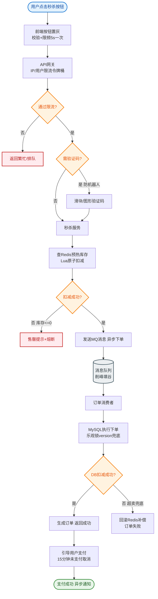
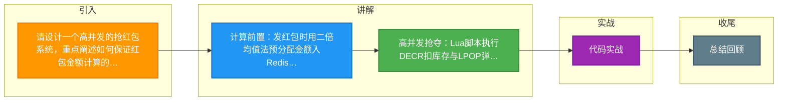

# 请设计一个高并发的抢红包系统，重点阐述如何保证红包金额计算的准确性以及在高并发下的性能优化。

抢红包系统设计核心在于将资金计算与红包分配解耦。首先，采用二倍均值法等预分配算法，在抢红包动作发生前由后台线程批量计算好每个红包的金额并存入缓存（如Redis List或Hash），将'写'操作前置，避免用户抢红包时的实时计算锁竞争。

架构上，利用Redis的单线程特性和原子操作（如DECR/POP）来保证并发抢取的互斥性，避免超发。用户抢红包只需执行原子操作扣减库存，并异步记录流水。对于数据库压力，采用MQ异步削峰，将落地流水和解冻资金的操作异步化。

一致性方面，利用数据库事务或TCC模式确保资金流转准确，设置Lua脚本保证Redis操作的原子性。此外，为防止恶意刷单，可结合用户维度限流和布隆过滤器进行前置校验。

**实战案例**：
在某春节活动中，曾出现因为Lua脚本处理逻辑过于复杂（包含大量用户资格校验），导致单个Redis节点CPU飙升至100%，造成服务雪崩。优化后将“资格校验”前置到网关层，Redis Lua脚本仅保留纯粹的“扣库存+返回金额”逻辑，大幅降低了RT。

**代码示例（Redis Lua 抢红包核心）**：
```lua
-- 参数: key(红包库存Key), amountKey(金额HashKey)
local count = redis.call('decr', KEYS[1])
if count < 0 then
    redis.call('incr', KEYS[1]) -- 回滚
    return 0
else
    local money = redis.call('lpop', KEYS[2])
    return money -- 返回抢到的金额
end
```

## 技术原理

抢红包系统的核心挑战是「资金准确性 + 极限并发」，解法是「写前置 + 原子读 + 异步落地」三段式架构：

- **计算前置（二倍均值法）**：发红包时，金额分配不能用「随机分剩余」（会出现最后一个人拿到 0 或超额）。二倍均值法：每次抢的金额上限为「剩余金额 ÷ 剩余人数 × 2」的随机值。例如 100 元分 10 人：第一次上限 100/10×2=20 元，随机取 0~20 之间；假设取 15 元，剩 85 元 9 人，第二次上限 85/9×2≈18.9 元……保证每人至少 0.01 元且总和等于红包总额。发红包时批量算好所有金额，存入 Redis List（`RPUSH red:001 15 8 23 ...`），把「写」操作前置，避免抢红包时的实时计算和锁竞争。
- **原子抢取（Lua 脚本）**：抢红包是「扣库存 + 弹金额」两步，必须原子。Lua 脚本在 Redis 单线程内执行：`DECR` 扣库存，若结果 < 0 说明抢光了，`INCR` 回滚返回 0；否则 `LPOP` 弹出一个预分配金额返回给用户。整个过程无锁、无重试、一次网络往返，单 Redis 实例可支撑 10 万+ QPS。
- **异步削峰（MQ 落库）**：Redis 抢成功后不立即写数据库（DB 扛不住高并发写），而是发一条 MQ 消息（含红包ID、用户ID、金额）。下游消费者异步批量写流水表、更新账户余额。DB 侧用 TCC（Try-Confirm-Cancel）或本地事务保证资金最终一致。
- **防超发的多道防线**：(1) Lua 脚本保证 Redis 层不超发；(2) MQ 消费幂等（防重复消费导致多次入账）；(3) 定时对账（Redis 已抢数量 vs DB 流水数量），发现差异自动补偿。

## 代码示例

```python
# 二倍均值法：发红包时预分配金额
import random

def split_red_packet(total: int, count: int, min_amount: int = 1) -> list[int]:
    """二倍均值法拆分红包，返回金额列表（单位：分）"""
    amounts = []
    remaining = total
    for i in range(count - 1):
        # 上限 = 剩余金额 / 剩余人数 * 2
        max_get = (remaining - (count - i - 1) * min_amount) * 2 // (count - i)
        amount = random.randint(min_amount, max(min_amount, max_get))
        amounts.append(amount)
        remaining -= amount
    amounts.append(remaining)   # 最后一人拿剩余全部
    random.shuffle(amounts)      # 打乱顺序，避免 List 顺序泄露金额规律
    return amounts

# 预存到 Redis List
def create_red_packet(rpid: str, total: int, count: int):
    amounts = split_red_packet(total, count)
    pipe = redis.pipeline()
    pipe.rpush(f"red:{rpid}:amounts", *amounts)   # 金额队列
    pipe.set(f"red:{rpid}:stock", count)           # 剩余库存
    pipe.expire(f"red:{rpid}:amounts", 86400)      # 24小时过期
    pipe.expire(f"red:{rpid}:stock", 86400)
    pipe.execute()
```

```java
// 抢红包全链路（Java 伪代码）
@Service
public class GrabRedPacketService {
    @Autowired private RedisTemplate<String, String> redis;
    @Autowired private RocketMQTemplate mq;

    public long grab(String rpid, String userId) {
        // 1. 前置校验：用户是否已抢过（布隆过滤器，防刷）
        if (bloomFilter.mightContain("grabbed:" + rpid + ":" + userId)) {
            throw new BizException("已抢过该红包");
        }
        // 2. Lua 原子扣库存 + 弹金额
        Long money = redis.execute(GRAB_SCRIPT,
            Arrays.asList("red:" + rpid + ":stock", "red:" + rpid + ":amounts"),
            userId);
        if (money == null || money == 0) throw new BizException("手慢了，红包已抢完");
        // 3. 标记已抢（防重复）
        bloomFilter.add("grabbed:" + rpid + ":" + userId);
        // 4. 异步落库（MQ 削峰）
        mq.asyncSend("redpacket-grab-log",
            new GrabRecord(rpid, userId, money, System.currentTimeMillis()));
        return money;   // 同步返回金额给用户
    }
}

// MQ 消费者：异步写流水 + 更新余额
@RocketMQMessageListener(topic = "redpacket-grab-log")
public class GrabLogConsumer implements RocketMQListener<GrabRecord> {
    @Transactional
    public void onMessage(GrabRecord r) {
        // 幂等检查：流水表唯一索引 (rpid, userId)
        if (flowDao.exists(r.getRpid(), r.getUserId())) return;
        flowDao.insert(r);                      // 写流水
        accountDao.incrBalance(r.getUserId(), r.getMoney());  // 加余额
    }
}
```

## 注意事项

- **Lua 脚本必须精简**：如实战案例所示，把资格校验、限流等复杂逻辑塞进 Lua 会拖垮 Redis CPU。Lua 只做「扣库存 + 弹金额」核心操作，其他校验前置到网关或应用层。
- **金额精度用整数**：金额一律用「分」为单位存储和计算（整数），避免浮点精度问题。展示时再除以 100 转元。
- **红包过期处理**：红包 24 小时未抢完，剩余金额要退回发送者账户。需定时任务扫描过期红包，把 List 剩余金额汇总退款。
- **热点红包的分片**：单个爆款红包（如群红包）的 Key 是热点。可把库存拆分到多个子 Key（`red:001:stock:0~9`），用户抢时随机路由到某个子 Key，分摊单实例压力。
- **防刷策略**：(1) 用户级限流（令牌桶，每秒最多抢 N 次）；(2) 设备指纹/IP 维度限制；(3) 风控规则（新注册账号、异常设备拦截）；(4) 布隆过滤器防重复抢。
- **资金对账**：每日定时跑对账任务——Redis 已抢总额 + 退还总额 应等于 发送总额；DB 流水总额应等于 Redis 已抢总额。任何不一致触发告警和人工核查。
- **MQ 消费失败的补偿**：消息消费失败不能丢（资金场景），需重试 + 死信队列 + 人工兜底。Redis 已扣库存但 MQ 消费失败会导致「用户抢到但没入账」，需通过对账发现并补偿。


## 核心流程图


## 记忆要点

- 计算前置：发红包时用二倍均值法预分配金额入Redis List，避免实时计算锁竞争
- 高并发抢夺：Lua脚本执行DECR扣库存与LPOP弹金额，保证原子性防超发
- 异步削峰：抢取成功后通过MQ异步落库，数据库通过TCC/事务保证最终一致

## 结构化回答

**30 秒电梯演讲：** 请设计一个高并发的抢红包系统，重点阐述如何保证红包金额计算的准确性以及在高并发下的性能优化。落到工程上，发红包时用二倍均值法预分配金额入Redis List，避免实时计算锁竞争。

**展开框架：**
1. **计算前置** — 发红包时用二倍均值法预分配金额入Redis List，避免实时计算锁竞争
2. **高并发抢夺** — Lua脚本执行DECR扣库存与LPOP弹金额，保证原子性防超发
3. **异步削峰** — 抢取成功后通过MQ异步落库，数据库通过TCC/事务保证最终一致

**收尾：** 以上三点都能配合实战聊。我可以展开任一要点，您想先深入哪一块？

## 视频脚本

> 预计时长：3 分钟 | 由浅入深

| 时间 | 画面/字幕 | 口播台词 | 讲解要点 |
|------|----------|----------|----------|
| 0:00 | 标题卡：请设计一个高并发的抢红包系统，重点阐述如 | "请设计一个高并发的抢红包系统，重点阐述如，这题我会分三步讲。" | 开场钩子 |
| 0:41 | 概念定义动画 | "一句话：请设计一个高并发的抢红包系统，重点阐述如。" | 核心定义 |
| 1:22 | 概念定义动画 | "一句话：请设计一个高并发的抢红包系统，重点阐述如。" | 核心定义 |
| 2:03 | 计算前置 图解 | "发红包时用二倍均值法预分配金额入Redis List，避免实时计算锁竞争。" | 计算前置 |
| 2:50 | 高并发抢夺 图解 | "Lua脚本执行DECR扣库存与LPOP弹金额，保证原子性防超发。" | 高并发抢夺 |

### 视频流程图



