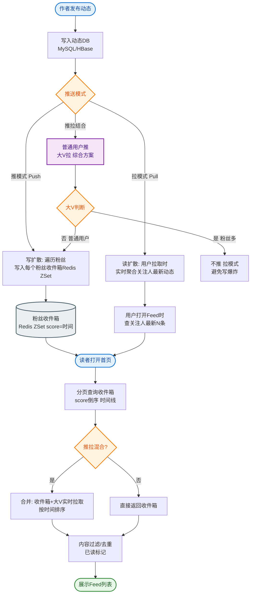

# 在设计一个Feed流系统（如朋友圈或微博）时，如何选择'拉模式'（Pull）与'推模式'（Push）？针对千万级用户的大V号，如何优化性能瓶颈？

Feed流设计中，'推模式'（写扩散）是指用户发帖时，将消息写入所有粉丝的收件箱，读取时直接读收件箱，优点是读快，缺点是写放大，不适合大V；'拉模式'（读扩散）是指用户刷新时，实时查询关注列表的发件箱并聚合排序，优点是写成本低，缺点是读延迟高且计算量大。

针对千万级粉丝的大V，纯推模式会导致数据库写入爆炸。通常采用'推拉结合'的策略：
1. **活跃粉丝推，非活跃拉**：只将消息推送给活跃粉丝（如最近7天登录），非活跃粉丝刷新时再触发拉取。
2. **分层存储**：大V的存储与普通用户分离，建立专门的'热数据'索引或使用更高效的存储。
3. **异步化**：推操作完全异步化，利用MQ削峰，确保发帖响应不阻塞。

通过这种混合策略，既保证了普通用户的极速体验，又控制了系统资源的消耗。

**实战案例**：
某微博平台曾遭遇“明星官宣”导致的写入风暴，由于该明星粉丝5000万，全量推送导致消息队列积压严重，普通用户发帖延迟高达数秒。引入推拉结合模式后，只对最近30天活跃的200万粉丝进行推送，系统写入量降低了96%。

**对比表格**：

| 特性 | 推模式 (写扩散) | 拉模式 (读扩散) | 推拉结合模式 |
| :--- | :--- | :--- | :--- |
| **写操作复杂度** | 高 (O(粉丝数))，写放大 | 低 (O(1)) | 中 (取决于活跃粉丝数) |
| **读操作复杂度** | 低 (O(1)读收件箱) | 高 (需聚合排序关注列表) | 低 (读收件箱) + 中 (部分拉取) |
| **大V场景** | 性能瓶颈，极易写爆 | 性能极佳，但加载慢 | 平衡，资源消耗可控 |
| **实时性** | 极高 | 较低 (需聚合计算) | 高 (活跃用户实时) |
| **适用场景** | 粉丝数较少的普通用户 | 大V账号，单向关注 | 综合类社交平台 (如Twitter/微博) |

## 技术原理

Feed 流的推/拉选择本质是「写放大 vs 读放大」的权衡，核心在于读写比例和粉丝分布：

- **推模式（写扩散/Fanout-on-write）**：用户发帖时，遍历其粉丝列表，把帖子 ID 写入每个粉丝的收件箱（inbox）。粉丝刷 Feed 时只需读自己的 inbox（O(1) 查询），读延迟极低。代价是「写放大」——一个 10 万粉丝的用户发一条帖子要写 10 万次。普通用户（粉丝 < 1000）写放大可接受，但千万粉丝的大 V 发一条要写千万次，瞬间打爆 DB 和 MQ。
- **拉模式（读扩散/Fanout-on-read）**：用户发帖只写自己的发件箱（outbox，O(1) 写）。粉丝刷 Feed 时，查询关注列表的所有人 outbox，拉取最新帖子，合并排序后返回。写成本恒定，但读成本高——关注 500 人要查 500 个 outbox 并做 top-K 归并排序，延迟和计算量大。适合大 V（写少但被读多）和单向关注场景（用户关注多但互动少）。
- **推拉结合（混合模式）**：按用户类型分流——(1) 普通用户（粉丝少）发帖 → 推给所有粉丝的 inbox；(2) 大 V 发帖 → 不推，粉丝刷 Feed 时走拉模式实时聚合大 V 的 outbox。进一步优化：只推「最近 N 天活跃」的粉丝（非活跃粉丝登录时再触发拉取），把推送量再砍一个数量级。这是 Twitter/微博的生产实践。
- **收件箱的数据结构**：inbox 通常用 Redis ZSet（按时间戳排序）或 Timeline 服务（如专门的 feed 存储）。ZSet 天然按 score 排序，`ZREVRANGEBYSCORE` 即可分页拉取最新帖子，限制 size（如保留最近 1000 条）控制内存。

## 代码示例

```python
# 推拉结合策略：发帖时按粉丝规模分流
def publish_post(user_id: str, post_id: str, content: str):
    fan_count = get_fan_count(user_id)        # 粉丝数
    is_big_v = fan_count > THRESHOLD           # 阈值如 10 万

    # 1. 所有用户：写入自己的 outbox（拉模式的基石）
    redis.zadd(f"outbox:{user_id}", {post_id: time.time()})

    if not is_big_v:
        # 2a. 普通用户：推给所有粉丝的 inbox（写扩散）
        fans = get_all_fans(user_id)
        pipe = redis.pipeline()
        for fan_id in fans:
            pipe.zadd(f"inbox:{fan_id}", {post_id: time.time()})
            pipe.zremrangebyrank(f"inbox:{fan_id}", 0, -1001)  # 只保留最近 1000 条
        pipe.execute()
    else:
        # 2b. 大 V：只推给活跃粉丝（最近 7 天登录），非活跃不推
        active_fans = get_active_fans(user_id, days=7)  # 如 200 万而非 5000 万
        async_push_to_inbox(active_fans, post_id)        # MQ 异步推送
        # 大 V 的帖子标记为"需要拉取"，粉丝刷 Feed 时会主动拉 outbox

def get_active_fans(user_id, days=7):
    """只返回最近活跃的粉丝（用 Bitmap 或活跃用户表）"""
    all_fans = get_all_fans(user_id)
    return [f for f in all_fans if is_active(f, days)]   # 过滤掉僵尸粉
```

```python
# 刷 Feed：推拉混合读取
def get_feed(user_id: str, page: int) -> list[str]:
    # 1. 读自己的 inbox（已推送的普通用户帖子 + 活跃大 V 帖子）
    pushed = redis.zrevrange(f"inbox:{user_id}", page*20, (page+1)*20-1)

    # 2. 拉取关注的大 V 的 outbox（未推送的部分）
    big_v_followings = get_big_v_followings(user_id)  # 关注的大 V 列表
    pulled = []
    for bv in big_v_followings:
        recent = redis.zrevrange(f"outbox:{bv}", 0, 19)  # 每个大 V 最近 20 条
        pulled.extend(recent)

    # 3. 合并去重 + 按时间排序
    all_posts = list(set(pushed + pulled))
    all_posts.sort(key=lambda pid: get_timestamp(pid), reverse=True)
    return all_posts[:20]   # 返回最新 20 条
```

## 注意事项

- **活跃粉丝的判定**：用 Bitmap（每位代表一个用户当天是否活跃）或专门的活跃用户表。判定要快（毫秒级），否则发帖延迟增加。活跃窗口（如 7 天/30 天）要按业务调——窗口太短推送省得不多，太长失去意义。
- **推拉的一致性问题**：大 V 帖子靠拉模式，粉丝刷 Feed 时才聚合。如果粉丝刷的时候大 V 刚发帖，可能短暂延迟（最终一致）。实时性要求高的场景（如突发新闻）可对大 V 也做轻量推送（推给最近 1 小时活跃粉丝）。
- **收件箱的容量控制**：inbox 无限增长会撑爆内存。ZSet 限制保留最近 N 条（如 1000），超出用 `ZREMRANGEBYRANK` 删除最早的。历史 Feed 走 DB 分页查询。
- **冷启动问题**：新用户没有 inbox 数据，第一次刷 Feed 要全量拉取关注人的 outbox，延迟高。可用异步预热——用户注册/登录时触发后台任务预构建 inbox。
- **删帖/屏蔽的扩散**：用户删帖或被屏蔽时，已推送到各粉丝 inbox 的帖子 ID 要清理。常用「软删除」（帖子标记删除，读取时过滤）而非「物理清理 inbox」（成本高）。
- **热点事件的突发流量**：明星官宣等事件会导致短时间内大量用户同时刷 Feed，读请求激增。应对：inbox 读取加缓存（CDN/本地缓存）、热点内容预计算、限流降级。


## 核心流程图


## 记忆要点

- 核心概念：推即写扩散（读快写慢），拉即读扩散（写快读慢）
- 大V性能瓶颈：千万粉丝若纯推会引发写爆炸，导致数据库与MQ被打垮
- 推拉结合策略：只推最近活跃粉丝，非活跃粉丝登录时再触发拉取聚合

## 结构化回答

**30 秒电梯演讲：** 在设计一个Feed流系统（如朋友圈或微博）时，如何选择'拉模式'（Pull）与'推模式'（Push）？针对千万级用户的大V号，如何优化性能瓶颈？。落到工程上，推即写扩散(读快写慢)，拉即读扩散(写快读慢)。

**展开框架：**
1. **概念** — 推即写扩散(读快写慢)，拉即读扩散(写快读慢)
2. **大V性能瓶颈** — 千万粉丝若纯推会引发写爆炸，导致数据库与MQ被打垮
3. **推拉结合策略** — 只推最近活跃粉丝，非活跃粉丝登录时再触发拉取聚合

**收尾：** 以上三点都能配合实战聊。我可以展开任一要点，您想先深入哪一块？

## 视频脚本

> 预计时长：3 分钟 | 由浅入深

| 时间 | 画面/字幕 | 口播台词 | 讲解要点 |
|------|----------|----------|----------|
| 0:00 | 标题卡：在设计一个Feed流系统（如朋友圈或微博 | "在设计一个Feed流系统（如朋友圈或微博，这题我会分三步讲。" | 开场钩子 |
| 0:41 | 概念定义动画 | "一句话：在设计一个Feed流系统（如朋友圈或微博。" | 核心定义 |
| 1:22 | 概念定义动画 | "一句话：在设计一个Feed流系统（如朋友圈或微博。" | 核心定义 |
| 2:03 | 概念 图解 | "推即写扩散(读快写慢)，拉即读扩散(写快读慢)。" | 概念 |
| 2:50 | 大V性能瓶颈 图解 | "千万粉丝若纯推会引发写爆炸，导致数据库与MQ被打垮。" | 大V性能瓶颈 |
