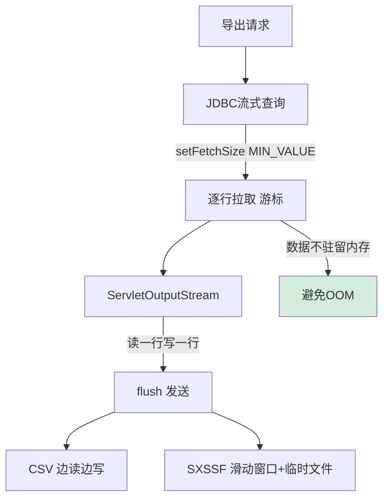
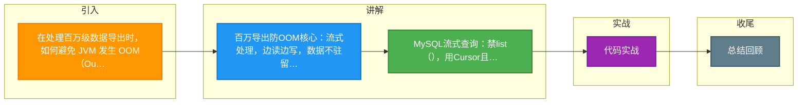

# 在处理百万级数据导出时，如何避免 JVM 发生 OOM（Out Of Memory）？请结合 MySQL 的流式查询和 HTTP 响应特性进行设计。

百万级数据导出 OOM 通常是因为一次性将所有数据加载到内存 List 中，或生成大文件未及时写入磁盘。解决方案：1. 数据库层面，禁止使用 `list.addAll()` 或 ORM 的 `list()` 方法，应使用 JDBC 的 `setFetchSize(Integer.MIN_VALUE)` 配合流式 `ResultSet`，保持数据库长连接，按行拉取数据。2. 应用层面，逐行读取 `ResultSet` 后，直接通过 `response.getOutputStream()` 写入 HTTP 流，或者使用 POI 的 SXSSFWorkbook（流式 Excel 写入）并配合临时文件落盘。3. 架构层面，可使用“异步导出+下载中心”模式，生成文件存储到 OSS/COS，返回下载链接，避免 HTTP 长连接超时。核心思想是“流式处理，边读边写，数据不驻留内存”。

**1. 实战案例**：
曾遇到一个订单导出接口，QA 测试几千条数据正常，上线后导出 50 万行数据直接 Full GC。排查发现 MyBatis 默认的 `List<Order> findAll()` 将所有对象加载到了堆内存。改用 `Cursor<Order>` 流式查询后，内存占用从 2GB 降至不到 100MB。

**2. 代码示例**：
```java
// MySQL 流式查询 + HTTP 响应流写入
try (Connection conn = dataSource.getConnection();
     PreparedStatement ps = conn.prepareStatement("SELECT * FROM large_table")) {
    // 关键：设置为 Integer.MIN_VALUE 开启流式
    ps.setFetchSize(Integer.MIN_VALUE);
    ResultSet rs = ps.executeQuery();
    ServletOutputStream out = response.getOutputStream();
    while (rs.next()) {
        out.write((rs.getString("data") + "\n").getBytes(StandardCharsets.UTF_8));
        out.flush(); // 及时刷盘，不堆积内存
    }
}
```

**3. 对比表格**：
| 维度 | 传统一次性加载 | 流式处理 |
| :--- | :--- | :--- |
| **内存占用** | 随数据量线性增长 (极易 OOM) | 恒定低占用 (仅当前行缓冲) |
| **响应速度** | 需等待全量加载完成 (慢) | 首字节响应快 (TTFB 小) |
| **JDBC 连接** | 用完即释放 | 长时间占用，不能复用 |
| **适用场景** | 小数据量 (< 1万条) | 大数据量导出 / ETL 处理 |

## 技术原理

百万级导出防 OOM 的核心是建立「端到端的数据流管道」，让数据在数据库、JVM、网络之间以「逐行」方式流动，而非全量驻留：

- **MySQL 流式查询的底层机制**：默认情况下 JDBC 的 `executeQuery()` 会一次性把结果集全部加载到客户端内存（JDBC 规范允许驱动预取）。MySQL Connector/J 的流式模式需要 `setFetchSize(Integer.MIN_VALUE)`——这是个魔法值，告诉驱动「逐行从服务器读取，不缓存」。此时 ResultSet 必须在 `Statement` 的事务内逐行消费（`rs.next()` 触发一次网络拉取），连接被长时间占用直到读完。代价是该连接在读取期间不能用于其他查询，且必须读完全部结果或显式 close，否则连接状态异常。
- **HTTP 流式响应的背压机制**：`response.getOutputStream()` 写入后调用 `flush()`，数据立即通过 TCP 推送给浏览器，而非堆积在 JVM 内存。浏览器的 TCP 接收窗口满时，会通过 ACK 通告窗口大小，反压服务端的写入速度（TCP flow control）。这意味着如果客户端下载慢，服务端的 `out.write()` 会阻塞，JVM 不会无限堆积数据——天然的背压保护。关键是要边读边 flush，避免 Servlet 容器的输出缓冲区（默认 8KB~32KB）累积过多。
- **Excel 导出的 SXSSF 滑动窗口**：Apache POI 的 XSSFWorkbook（.xlsx）默认把所有行存在内存，百万行直接 OOM。SXSSFWorkbook 是流式版本，维护一个固定大小的滑动窗口（默认 100 行），窗口满时把最早的行 flush 到磁盘临时文件，内存只保留最近 100 行。最终打包时合并临时文件和内存窗口，生成完整 xlsx。代价是已 flush 的行不能再修改（只读访问）。
- **异步导出 + 下载中心的架构**：百万级导出耗时可能几分钟，HTTP 长连接易超时（网关、浏览器都有超时限制）。改为异步模式：用户提交导出任务 → 后台 worker 异步生成文件存 OSS → 通知用户（站内信/邮件）→ 用户从下载中心拉取。解耦了导出耗时与 HTTP 连接，且支持重试和断点续传。

## 代码示例

```java
// 方案一：同步流式导出 CSV（适合 < 10 万行，耗时 < 30 秒）
@GetMapping("/export/orders")
public void exportOrders(HttpServletResponse response) throws Exception {
    response.setContentType("text/csv; charset=UTF-8");
    response.setHeader("Content-Disposition",
        "attachment; filename=\"orders_" + System.currentTimeMillis() + ".csv\"");
    // 关键：用 try-with-resources 确保连接和 Statement 释放
    try (Connection conn = dataSource.getConnection();
         PreparedStatement ps = conn.prepareStatement(
             "SELECT id, user_id, amount, create_time FROM orders",
             ResultSet.TYPE_FORWARD_ONLY,        // 只进游标
             ResultSet.CONCUR_READ_ONLY)) {
        ps.setFetchSize(Integer.MIN_VALUE);       // 开启 MySQL 流式读取
        ResultSet rs = ps.executeQuery();
        ServletOutputStream out = response.getOutputStream();
        // 写表头
        out.write("订单ID,用户ID,金额,时间\n".getBytes(UTF_8));
        // 逐行读、逐行写（内存中始终只有当前行）
        while (rs.next()) {
            String line = String.join(",",
                rs.getString("id"), rs.getString("user_id"),
                rs.getString("amount"), rs.getString("create_time")) + "\n";
            out.write(line.getBytes(UTF_8));
            if (rs.getRow() % 1000 == 0) out.flush();   // 每 1000 行 flush 一次
        }
        out.flush();
    }
}
```

```java
// 方案二：异步导出 Excel（适合百万行，耗时分钟级）
// 1. 提交任务
@PostMapping("/export/async")
public String submitExport(@RequestBody ExportRequest req) {
    String taskId = UUID.randomUUID().toString();
    mq.send("export-task", new ExportTask(taskId, req));   // 异步队列
    return taskId;   // 立即返回任务 ID
}

// 2. Worker 异步处理（SXSSF 流式写 Excel）
@RocketMQMessageListener(topic = "export-task")
public class ExportWorker {
    public void onMessage(ExportTask task) {
        // SXSSF：滑动窗口 100 行，超出 flush 到磁盘临时文件
        try (SXSSFWorkbook wb = new SXSSFWorkbook(100)) {
            Sheet sheet = wb.createSheet("orders");
            int rowIdx = 0;
            try (Connection conn = dataSource.getConnection();
                 PreparedStatement ps = conn.prepareStatement(SELECT_SQL)) {
                ps.setFetchSize(Integer.MIN_VALUE);
                ResultSet rs = ps.executeQuery();
                while (rs.next()) {
                    Row row = sheet.createRow(rowIdx++);
                    row.createCell(0).setCellValue(rs.getString("id"));
                    row.createCell(1).setCellValue(rs.getString("amount"));
                    // SXSSF 自动管理内存窗口
                }
            }
            // 生成文件上传 OSS
            String ossKey = "exports/" + task.taskId + ".xlsx";
            try (InputStream is = new ByteArrayInputStream(toBytes(wb))) {
                ossClient.putObject(ossKey, is);
            }
            // 清理临时文件（SXSSF 必须显式清理）
            wb.dispose();
            // 通知用户下载
            notifyService.notify(task.userId, "导出完成: " + ossKey);
        }
    }
}
```

## 注意事项

- **MySQL 流式查询的连接占用**：流式读取期间该连接被独占，不能复用。连接池要预留足够连接给流式查询，否则耗尽连接池影响其他业务。大导出建议用独立的连接池。
- **事务隔离级别的副作用**：流式查询在事务内执行，长事务会阻塞其他事务的 DDL 和 MVCC 清理。建议 `SET TRANSACTION ISOLATION LEVEL READ COMMITTED` 或加 `@Transactional(readOnly=true)`，并避免在循环中做写操作。
- **`setFetchSize` 的数据库差异**：MySQL 必须用 `Integer.MIN_VALUE`（魔法值）；Oracle/PostgreSQL 用正常的 fetch size（如 1000）。代码要按数据库类型适配，否则 MySQL 的流式不生效。
- **CSV 的特殊字符转义**：字段含逗号、引号、换行时必须用引号包裹并转义（RFC 4180）。建议用 OpenCSV/commons-csv 库而非手动拼接，避免格式错误导致解析失败。
- **SXSSF 的 `dispose()` 必须调用**：SXSSF 会在系统临时目录生成大量临时文件，不调用 `dispose()` 会泄漏磁盘空间。务必用 try-with-resources 或 finally 确保清理。
- **异步导出的状态管理**：用户提交后需要查询进度（「处理中/已完成/失败」）。任务状态存 Redis 或 DB，前端轮询或 WebSocket 推送进度。失败的导出要支持重试。
- **大文件下载的断点续传**：OSS 生成的文件支持 Range 请求（HTTP 206），客户端断网后可从断点续传，避免重新下载整个文件。浏览器原生支持，服务端只需确保 OSS 开启了断点续传。
- **资源限额与排队**：异步导出任务可能堆积（多个用户同时导出百万数据），worker 池要有限流（如最多 5 个并发导出），超出排队。防止单个导出任务耗尽 CPU/内存。


## 核心流程图




## 记忆要点

- 百万导出防OOM核心：流式处理，边读边写，数据不驻留内存
- MySQL流式查询：禁list()，用Cursor且必须setFetchSize(Integer.MIN_VALUE)
- 导出流式写：逐行读取直接写HTTP Response流，或用POI的SXSSF落盘
- 架构避坑：耗时导出用异步+下载中心(OSS)，避免HTTP长连接超时

## 结构化回答

**30 秒电梯演讲：** 数据库流式读取，HTTP流式响应，数据不驻留内存。打比方——像用自来水管接水，水流(数据)直接从水龙头(数据库)流向水桶(浏览器)，中间不经过杯子(内存)存储。落到工程上，设置setFetchSize(Integer.MIN_VALUE)，保持长连接逐行拉取。

**展开框架：**
1. **JDBC流式查询** — 设置setFetchSize(Integer.MIN_VALUE)，保持长连接逐行拉取
2. **HTTP流式写入** — 获取ServletOutputStream，读一行写一行，flush发送
3. **大文件处理** — CSV边读边写，Excel用SXSSFWorkbook滑动窗口+临时文件

**收尾：** 以上三点都能配合实战聊。我可以展开任一要点，您想先深入哪一块？

## 视频脚本

> 预计时长：2 分钟 | 由浅入深

| 时间 | 画面/字幕 | 口播台词 | 讲解要点 |
|------|----------|----------|----------|
| 0:00 | 标题卡：在处理百万级数据导出时，如何避免 JVM | "在处理百万级数据导出时，如何避免 JVM，一分钟讲透。" | 开场钩子 |
| 0:35 | 生活类比动画 | "打个比方——像用自来水管接水，水流(数据)直接从水龙头(数据库)流向水桶(浏览器)，中间不经过杯子(内存)存储。" | 核心类比 |
| 1:10 | 概念定义动画 | "一句话：数据库流式读取，HTTP流式响应，数据不驻留内存。" | 核心定义 |
| 1:50 | JDBC流式查询 图解 | "设置setFetchSize(Integer.MIN_VALUE)，保持长连接逐行拉取。" | JDBC流式查询 |

### 视频流程图



