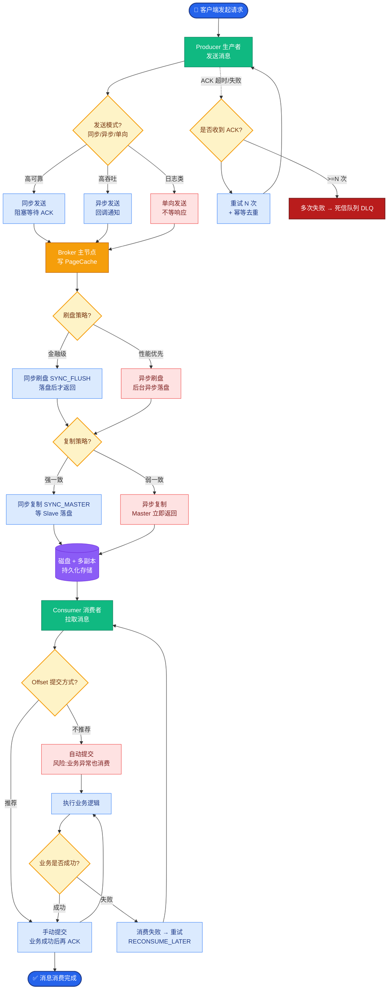
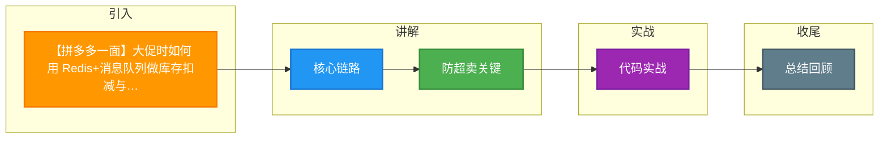

# 【拼多多一面】大促时如何用 Redis+消息队列做库存扣减与订单异步创建？

## 🎯 一句话本质

大促秒杀的核心架构：**Redis Lua脚本原子扣减库存**（防超卖、抗高并发）+ **消息队列异步创建订单**（削峰填谷、保护DB）+ **补偿机制**（最终一致性）。

## 🧒 费曼类比

```
传统方案（同步，慢）：
  用户 → 查库存 → 扣库存 → 创建订单 → 扣余额 → 通知物流 → 返回
  全程占用数据库连接 200ms，数据库1000 QPS上限 → 10000人抢购 → 9000人超时

Redis+MQ方案（异步，快）：
  用户 → Redis原子扣库存（1ms）→ 发MQ消息 → 立即返回"抢购成功，订单创建中"
         ↓ MQ消费者（按DB节奏）
         创建订单 → 扣余额 → 通知物流
  
  Redis 10万QPS → 瞬间消化10000人 → MQ排队 → DB按2000/s平稳消费 → 5秒内全部落库
```

## 📊 完整架构图

```
  用户请求 (万级QPS洪峰)
        │
        ▼
  ┌─────────────┐
  │  Nginx/Gateway │  ← 第一层：IP限流、令牌桶
  └──────┬──────┘
         │
  ┌──────▼──────┐
  │  应用服务层    │  ← 第二层：请求校验、幂等检查
  └──────┬──────┘
         │
  ┌──────▼──────────────────────┐
  │   Redis (Lua 原子扣减)        │  ← 第三层：核心防超卖
  │   stock:product:123 = 100    │
  │   ┌──────────────────────┐  │
  │   │ if redis.call('GET') │  │
  │   │  >= qty then          │  │
  │   │  redis.call('DECRBY') │  │
  │   │  return 1 -- 成功     │  │
  │   │ else return 0 -- 售罄 │  │
  │   │ end                   │  │
  │   └──────────────────────┘  │
  └──────┬──────────────────────┘
         │ 扣减成功
  ┌──────▼──────┐
  │  RocketMQ    │  ← 第四层：削峰填谷
  │  Topic:      │
  │  ORDER_CREATE│
  └──────┬──────┘
         │ 消费者按DB节奏消费
  ┌──────▼──────────────────────┐
  │   订单服务                     │
  │  1. 创建订单（MySQL事务）      │  ← 第五层：持久化
  │  2. 扣减用户余额               │
  │  3. DB乐观锁兜底:              │
  │     UPDATE stock              │
  │     SET count = count - qty   │
  │     WHERE id = ? AND count >= qty│
  └─────────────────────────────┘
         │
  ┌──────▼──────┐
  │  补偿任务     │  ← 第六层：兜底
  │  对账+回滚    │
  └─────────────┘
```

## 🔧 核心代码实现

### 1. Redis Lua脚本（原子扣减）

```lua
-- deduct_stock.lua
-- KEYS[1]: stock key, e.g., stock:product:123
-- ARGV[1]: 扣减数量
-- ARGV[2]: 用户ID（用于去重）
-- ARGV[3]: 请求唯一ID

-- 1. 幂等检查
local dedupKey = "dedup:" .. KEYS[1] .. ":" .. ARGV[3]
if redis.call('EXISTS', dedupKey) == 1 then
    return -1  -- 重复请求
end

-- 2. 检查并扣减库存
local stock = tonumber(redis.call('GET', KEYS[1]))
if stock == nil then
    return -2  -- 商品不存在
end
local qty = tonumber(ARGV[1])
if stock < qty then
    return 0   -- 库存不足
end

-- 3. 原子扣减 + 记录去重
redis.call('DECRBY', KEYS[1], qty)
redis.call('SET', dedupKey, '1', 'EX', 86400)  -- 24小时去重
redis.call('HINCRBY', KEYS[1] .. ':users', ARGV[2], qty)  -- 记录谁买了多少

return 1  -- 扣减成功
```

```java
@Service
public class SeckillService {
    
    @Autowired
    private RedisTemplate<String, String> redisTemplate;
    @Autowired
    private RocketMQTemplate mqProducer;
    
    private final DefaultRedisScript<Long> deductScript;
    
    @PostConstruct
    public void init() {
        deductScript = new DefaultRedisScript<>();
        deductScript.setLocation(new ClassPathResource("lua/deduct_stock.lua"));
        deductScript.setResultType(Long.class);
    }
    
    public SeckillResult seckill(Long productId, Long userId, int qty, String requestId) {
        String stockKey = "stock:product:" + productId;
        
        // 1. Redis Lua原子扣减（核心防超卖）
        Long result = redisTemplate.execute(deductScript,
            Collections.singletonList(stockKey),
            String.valueOf(qty), String.valueOf(userId), requestId);
        
        if (result == null || result == 0) {
            return SeckillResult.fail("库存不足，手慢了！");
        }
        if (result == -1) {
            return SeckillResult.fail("请勿重复提交");
        }
        if (result == -2) {
            return SeckillResult.fail("商品不存在");
        }
        
        // 2. 发送MQ消息异步创建订单
        OrderMessage msg = new OrderMessage(productId, userId, qty, requestId);
        mqProducer.asyncSend("ORDER_CREATE_TOPIC", msg, new SendCallback() {
            @Override
            public void onSuccess(SendResult sendResult) {
                log.info("订单消息发送成功: {}", requestId);
            }
            @Override
            public void onException(Throwable e) {
                log.error("订单消息发送失败: {}", requestId, e);
                // 发送失败 → 回滚Redis库存
                redisTemplate.opsForValue().increment(stockKey, qty);
            }
        });
        
        // 3. 立即返回（不等订单创建完成）
        return SeckillResult.success("抢购成功，订单创建中...", requestId);
    }
}
```

### 2. MQ消费者（异步创建订单）

```java
@RocketMQMessageListener(topic = "ORDER_CREATE_TOPIC", 
                         consumerGroup = "order_consumer_group",
                         consumeMode = ConsumeMode.CONCURRENTLY)
public class OrderCreateConsumer implements RocketMQListener<OrderMessage> {
    
    @Override
    @Transactional
    public void onMessage(OrderMessage msg) {
        // 幂等检查
        if (orderRepository.existsByRequestId(msg.getRequestId())) {
            return; // 已处理
        }
        
        // 创建订单 + 扣余额（本地事务）
        Order order = new Order(msg.getProductId(), msg.getUserId(), msg.getQty());
        orderRepository.save(order);
        accountService.deduct(msg.getUserId(), order.getTotalAmount());
        
        // DB层库存兜底（乐观锁）
        int updated = inventoryMapper.deductWithOptimisticLock(
            msg.getProductId(), msg.getQty());
        if (updated == 0) {
            // DB库存不足（理论上不会发生，Redis已预扣）
            log.error("DB库存扣减失败: {}", msg);
            throw new RuntimeException("DB库存不足，触发补偿");
        }
    }
}
```

### 3. 补偿对账任务

```java
@Scheduled(cron = "0 */5 * * * ?")  // 每5分钟
public void reconcile() {
    // 1. 查找Redis已扣减但DB订单未创建的记录
    List<String> pendingOrders = redisTemplate.opsForList()
        .range("pending:orders", 0, -1);
    
    for (String orderId : pendingOrders) {
        if (!orderRepository.existsById(orderId)) {
            // 重新发送MQ消息
            mqProducer.syncSend("ORDER_CREATE_TOPIC", recoverMessage(orderId));
        }
    }
    
    // 2. 对账：Redis库存 vs DB库存
    Long redisStock = redisTemplate.opsForValue().get("stock:product:123");
    Integer dbStock = inventoryRepository.getStock(123L);
    if (!redisStock.equals(Long.valueOf(dbStock))) {
        log.warn("库存不一致: Redis={}, DB={}", redisStock, dbStock);
        alertService.sendAlert("库存不一致告警");
    }
}
```

## 📋 面试加分点

1. **热点商品分片**：百万人抢购同一商品时，Redis单key热点问题 → 将库存拆分到多个key（如 `stock:product:123_0` 到 `stock:product:123_9`），随机路由扣减。

2. **本地缓存预判**：用Caffeine/Guava本地缓存标记"已售罄"商品，请求直接返回不查Redis。

3. **容器化扩容**：大促前HPA自动扩容消费者Pod，提高MQ消费速度。

4. **防刷策略**：用户维度限流（如每个用户每秒1次）、设备指纹、验证码、答题。

5. **库存预热**：大促前通过后台任务将DB库存同步到Redis，确保初始值准确。

## ❓ 苏格拉底式面试追问

1. **"Redis扣减成功但MQ发送失败，你回滚了Redis库存。但此时如果MQ实际已发送成功（网络抖动），消费端创建了订单怎么办？"**
   → 消费端做幂等检查 + 对账任务发现多扣库存后人工/自动回滚

2. **"你说热点商品库存分10个key，那某个key先卖完了，别的key还有库存，怎么保证用户不报错？"**
   → 路由策略：先随机选key，卖完后自动轮转到下一个key

3. **"如果大促期间Redis挂了怎么办？降级方案是什么？"**
   → 本地缓存降级（提示活动太火爆）→ DB直接扣减（QPS下降但功能可用）

4. **"为什么DB层还要用乐观锁兜底？Redis不是已经保证了不超卖吗？"**
   → 防止Redis和DB不一致（Redis恢复、补偿重试等边界情况），多重保险

5. **"你提到异步创建订单，用户看到的页面是'排队中'。如果创建失败了，用户体验怎么处理？"**
   → 5分钟超时 → 推送通知 + 回滚Redis库存 + 发优惠券补偿


## 核心流程图



## 结构化回答

**30 秒电梯演讲：** 大促场景下用Redis+Lua保证库存原子扣减（防超卖），通过消息队列异步创建订单削峰填谷，用补偿机制保证最终一致性。

**展开框架：**
1. **核心链路** — 限流 → Redis Lua原子扣减 → MQ异步 → DB落库 → 补偿兜底
2. **防超卖关键** — Lua脚本保证CHECK+DEDUCT原子性，不能用先查后减
3. **削峰关键** — MQ异步解耦，DB按消费速率平稳写入

**收尾：** 这块我踩过坑——要不要深入聊：Lua脚本扣减失败了怎么办？用户等了半天发现没货？

## 视频脚本

> 预计时长：4 分钟 | 由浅入深

| 时间 | 画面/字幕 | 口播台词 | 讲解要点 |
|------|----------|----------|----------|
| 0:00 | 标题卡 | "高并发一句话：大促场景下用Redis+Lua保证库存原子扣减（防超卖），通过消息队列异步创建订单削峰填谷…。" | 开场钩子 |
| 0:15 | Redis Lua 脚本执行截图 | "核心链路：限流 到 Redis Lua原子扣减 到 MQ异步 到 DB落库 到 补偿兜底" | 核心链路 |
| 1:08 | Redis Lua 脚本执行截图分步演示 | "防超卖关键：Lua脚本保证CHECK+DEDUCT原子性，不能用先查后减" | 防超卖关键 |
| 2:01 | 关键代码/伪代码片段 | "削峰关键：MQ异步解耦，DB按消费速率平稳写入" | 削峰关键 |
| 2:54 | 对比表格 | "幂等保证：订单号/requestId去重，防止重复扣减" | 幂等保证 |
| 3:50 | 总结卡 | "核心抓住这条主线，下期咱们接着聊：Lua脚本扣减失败了怎么办？用户等了半天发现没货。" | 收尾 |

### 视频流程图




