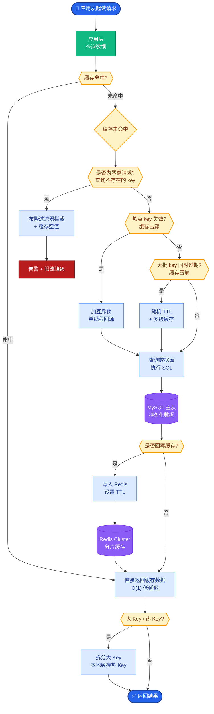
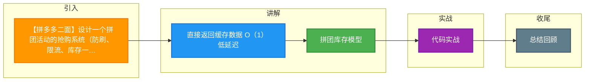

# 【拼多多二面】设计一个拼团活动的抢购系统（防刷、限流、库存一致性）

## 🎯 一句话本质

拼团抢购系统的核心是**库存状态机管理**（锁定→确认/释放）+ **三维度防刷** + **双层限流**。与秒杀的关键区别是库存"先锁后确认"，需要超时释放机制。

## 🧒 费曼类比

```
秒杀 = 买票（交钱就走，库存直接减）
拼团 = 组团旅游（先报名占名额 → 等够人数才出发 → 人数不够退名额）

拼团生命周期：
  团长开团 ──→ 锁定1个名额
  成员A加入 ──→ 锁定1个名额
  成员B加入 ──→ 锁定1个名额
  人齐了！   ──→ 确认扣减3个名额，下单付款
  或 24小时超时 ──→ 释放3个名额回库存池
```

## 📊 系统架构图

```
                    ┌────────────┐
                    │  用户请求    │
                    └─────┬──────┘
                          │
                ┌─────────▼─────────┐
                │  API Gateway       │  ← 限流层1：令牌桶（全局QPS上限）
                │  IP限流/黑名单      │
                │  设备指纹校验       │  ← 防刷层
                └─────────┬─────────┘
                          │
                ┌─────────▼─────────┐
                │  风控服务           │  ← 防刷层
                │  用户维度限流       │  （每用户每小时限开N团）
                │  设备维度限流       │
                │  行为分析           │
                └─────────┬─────────┘
                          │
                ┌─────────▼─────────┐
                │  拼团服务           │  ← 限流层2：Sentinel滑动窗口
                │  开团/加团/取消     │
                └─────────┬─────────┘
                          │
         ┌────────────────▼────────────────┐
         │       Redis（库存核心）            │
         │  ┌──────────────────────────┐    │
         │  │ stock:product:123 = 100  │    │  ← 可用库存
         │  │ locked:product:123 = 30  │    │  ← 已锁定库存
         │  │ sold:product:123 = 20    │    │  ← 已售出库存
         │  │ group:active:{gid} = ... │    │  ← 活跃拼团详情
         │  └──────────────────────────┘    │
         │  Lua脚本：CHECK + LOCK 原子操作   │
         └────────────────┬────────────────┘
                          │ 成团/加团成功
                ┌─────────▼─────────┐
                │  RocketMQ          │  ← 异步解耦
                │  GROUP_SUCCESS     │
                │  GROUP_TIMEOUT     │
                └─────────┬─────────┘
                          │
         ┌────────────────▼────────────────┐
         │  订单服务 + DB                     │  ← 持久化
         │  创建订单 + 扣减DB库存              │
         └──────────────────────────────────┘

         ┌──────────────────────────────────┐
         │  定时任务（每1分钟）                 │  ← 超时释放
         │  扫描超时未成团的拼团                │
         │  释放锁定的库存回可用池              │
         └──────────────────────────────────┘
```

## 🔧 核心实现

### 1. 拼团状态机

```
                   开团
                    │
                    ▼
              ┌──────────┐
              │ 待成团    │ ← 等待成员加入（24h有效期）
              └──┬───┬───┘
         成员满员  │   │ 超时/团长取消
                 │   │
          ┌──────▼┐ ┌▼──────────┐
          │ 已成团 │ │  已失败     │
          └──────┬┘ └──────┬─────┘
                 │          │ 释放锁定库存
          付款成功│          ▼
                 │    ┌──────────┐
          ┌──────▼┐   │ 库存回滚   │
          │ 已完成 │   └──────────┘
          └───────┘
```

### 2. Redis Lua脚本：原子锁定库存

```lua
-- group_join.lua
-- KEYS[1]: stock key (stock:product:123)
-- KEYS[2]: locked key (locked:product:123)
-- ARGV[1]: userId
-- ARGV[2]: productId
-- ARGV[3]: groupId
-- ARGV[4]: requestId

-- 1. 幂等检查
if redis.call('SISMEMBER', KEYS[1]..':joined', ARGV[3]..':'..ARGV[1]) == 1 then
    return -1  -- 已加入该团
end

-- 2. 检查可用库存
local available = tonumber(redis.call('GET', KEYS[1]))
if not available or available < 1 then
    return 0  -- 库存不足
end

-- 3. 原子扣减可用库存 + 增加锁定库存
redis.call('DECR', KEYS[1])
redis.call('INCR', KEYS[2])

-- 4. 记录用户已加入
redis.call('SADD', KEYS[1]..':joined', ARGV[3]..':'..ARGV[1])

-- 5. 记录锁定详情（用于超时释放）
redis.call('HSET', 'locked:detail:'..ARGV[3]..':'..ARGV[1],
    'userId', ARGV[1], 'productId', ARGV[2],
    'groupId', ARGV[3], 'lockTime', redis.call('TIME')[1])

-- 6. 设置24小时TTL自动过期
redis.call('EXPIRE', 'locked:detail:'..ARGV[3]..':'..ARGV[1], 86400)

return 1  -- 锁定成功
```

### 3. 防刷设计（三维度限流）

```java
@Service
public class AntiFraudService {
    
    @Autowired private RedisTemplate<String, String> redis;
    
    public boolean check(String userId, String deviceId, String ip) {
        // 维度1：用户限流（每小时最多开3个团）
        String userKey = "ratelimit:user:" + userId;
        if (redis.opsForValue().increment(userKey) > 3) {
            redis.expire(userKey, 1, TimeUnit.HOURS);
            return false;  // 触发限流
        }
        redis.expire(userKey, 1, TimeUnit.HOURS);
        
        // 维度2：设备限流（同一设备每小时最多5次）
        String deviceKey = "ratelimit:device:" + deviceId;
        if (redis.opsForValue().increment(deviceKey) > 5) {
            redis.expire(deviceKey, 1, TimeUnit.HOURS);
            return false;
        }
        redis.expire(deviceKey, 1, TimeUnit.HOURS);
        
        // 维度3：IP限流（同一IP每分钟最多10次）
        String ipKey = "ratelimit:ip:" + ip;
        if (redis.opsForValue().increment(ipKey) > 10) {
            redis.expire(ipKey, 1, TimeUnit.MINUTES);
            return false;
        }
        redis.expire(ipKey, 1, TimeUnit.MINUTES);
        
        // 维度4：风控规则（历史行为分析）
        if (riskService.isHighRisk(userId, deviceId, ip)) {
            return false;
        }
        
        return true;
    }
}
```

### 4. 超时释放库存（定时任务）

```java
@Scheduled(fixedRate = 60000)  // 每分钟扫描
public void releaseExpiredGroups() {
    // 获取分布式锁，防止多实例重复处理
    String lockKey = "lock:expire:scan";
    String lockValue = UUID.randomUUID().toString();
    
    Boolean locked = redis.opsForValue()
        .setIfAbsent(lockKey, lockValue, 55, TimeUnit.SECONDS);
    if (Boolean.FALSE.equals(locked)) return;
    
    try {
        // 查找24小时前创建且状态为"待成团"的拼团
        List<Group> expired = groupRepository.findExpiredGroups(
            GroupStatus.PENDING, LocalDateTime.now().minusHours(24));
        
        for (Group group : expired) {
            // 释放该团所有锁定的库存
            for (GroupMember member : group.getMembers()) {
                String lockDetailKey = "locked:detail:" + group.getId() + ":" + member.getUserId();
                // 回滚：可用库存+1，锁定库存-1
                redis.opsForValue().increment("stock:product:" + group.getProductId());
                redis.opsForValue().decrement("locked:product:" + group.getProductId());
                redis.delete(lockDetailKey);
            }
            // 更新拼团状态
            group.setStatus(GroupStatus.FAILED);
            groupRepository.save(group);
            
            // 通知团员
            notifyService.notifyGroupFailed(group);
        }
    } finally {
        // 释放锁（Lua保证原子性）
        releaseLock(lockKey, lockValue);
    }
}
```

## 📋 拼团 vs 秒杀对比

| 维度 | 秒杀 | 拼团 |
|------|------|------|
| 库存模型 | 直接扣减 | 锁定→确认/释放 |
| 用户行为 | 独立购买 | 组队协作 |
| 时间因素 | 无（先到先得） | 有（24h成团期限） |
| 库存回滚 | 一般不需要（退款单独处理） | 核心功能（超时/取消必释放） |
| 并发重点 | 防超卖 | 防超卖 + 防超锁 |
| 状态复杂度 | 低（2状态） | 高（4+状态） |

## ❓ 苏格拉底式面试追问

1. **"你说开团时锁定库存，但如果同一商品同时有1000个拼团在活动，Redis的库存怎么管理？是每个团独立一份还是共享？"**
   → 共享一份可用库存池，每个团锁定的是池中的份额。总数 = 可用 + 所有团锁定 + 已售出

2. **"如果团长开团后，在24小时内一直邀请不到人，但库存被锁定了导致其他用户买不了，怎么平衡？"**
   → 设置阶梯释放策略：前2小时全锁，之后逐步释放30%/50%/全部

3. **"防刷规则太严格可能误伤正常用户，你怎么平衡？"**
   → 分级风控：轻级（验证码）→ 中级（限流降速）→ 重级（拦截）。给用户申诉通道

4. **"拼团优惠的分摊算法：团长免单场景，3人团，团长0元，其他2人平摊。退款时怎么处理？"**
   → 按实际支付比例退款，记录每个成员的实际支付金额

5. **"如果要支持万人团（10000人），架构需要怎么调整？"**
   → 分片策略：按团ID哈希到不同Redis实例，避免单实例热点


## 核心流程图



## 结构化回答

**30 秒电梯演讲：** 拼团抢购系统需要解决三个核心问题：防刷（用户维度限流+设备指纹+风控）、限流（网关层令牌桶+应用层滑动窗口）、库存一致性（Redis预扣+DB乐观锁+超时释放）。

**展开框架：**
1. **拼团库存模型** — 可用 = 总量 - 已锁定 - 已售出，不是简单的DECR
2. **三层防护** — 防刷（用户+设备+IP限流）→ 限流（网关+应用双层）→ 库存（Redis预扣+DB兜底）
3. **状态机** — 开团(锁定库存) → 待成团 → 成团(扣减库存) / 超时失败(释放库存)

**收尾：** 这块我踩过坑——要不要深入聊：拼团超时自动失败的定时任务，如果任务执行慢导致库存长时间不释放，怎么办？

## 视频脚本

> 预计时长：4 分钟 | 由浅入深

| 时间 | 画面/字幕 | 口播台词 | 讲解要点 |
|------|----------|----------|----------|
| 0:00 | 标题卡 | "高并发一句话：拼团抢购系统需要解决三个核心问题：防刷（用户维度限流+设备指纹+风控）…。" | 开场钩子 |
| 0:15 | Redis Lua 脚本执行截图 | "拼团库存模型：可用 就是 总量 - 已锁定 - 已售出，不是简单的DECR" | 拼团库存模型 |
| 1:08 | Redis Lua 脚本执行截图分步演示 | "三层防护：防刷（用户+设备+IP限流）到 限流（网关+应用双层）到 库存（Redis预扣+DB兜底）" | 三层防护 |
| 2:01 | 关键代码/伪代码片段 | "状态机：开团(锁定库存) 到 待成团 到 成团(扣减库存) / 超时失败(释放库存)" | 状态机 |
| 2:54 | 对比表格 | "关键：定时任务扫描超时拼团 + 分布式锁防止重复处理" | 关键 |
| 3:50 | 总结卡 | "核心抓住这条主线，下期咱们接着聊：拼团超时自动失败的定时任务，如果任务执行慢导致库存长时间不释放，怎么办。" | 收尾 |

### 视频流程图




